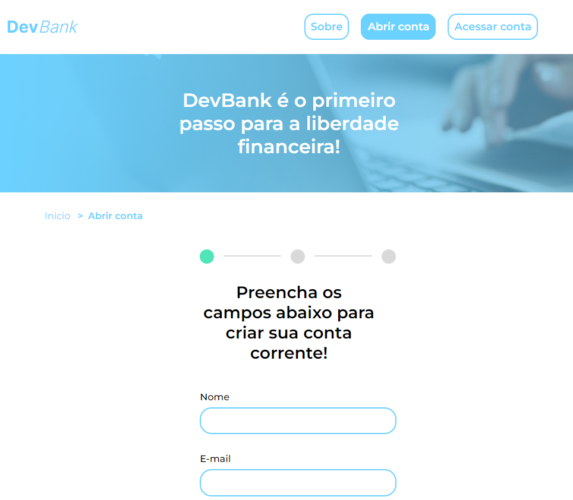
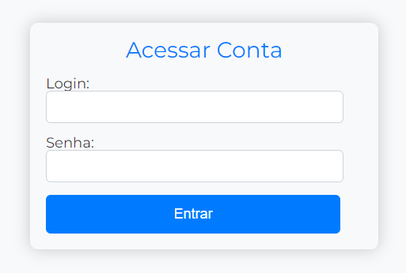

# DevBank - Seu Banco Virtual

Este projeto tem como objetivo a criação de um site de um banco ficticio onde o cliente pode abrir sua conta (apos enviar os dados e uma foto),
a conta é aprovada na hora e o cliente pode entrar na tela de acesso e fazer login.

### Ferramentas

Esse codigo utiliza como ferramenta principal o localStorage para armezenar os dados do usurio no navegador,
e depois do cadastro ler esses dados para realização do login.

#### Seja bem Vindo ao nosso Banco:

  

#### Login:

  

### Funcionalidades Principais:

1. **Abrir Conta:**

   - Preencha o formulário com seus dados pessoais, como nome, e-mail, RG, CPF, data de nascimento e senha.
   - Aceite os termos e condições para concluir o processo.

2. **Acessar Conta:**
   - Utilize o login (e-mail) e senha fornecidos durante a abertura da conta.

### Tecnologias Utilizadas:

- **HTML:** Estruturação da página.
- **CSS:** Estilização e design responsivo.
- **JavaScript:** Interação dinâmica e validações.
- **LocalStorage:** Armazenamento local para dados de conta (e-mail e senha).

### Estrutura do Projeto:

- **index.html:** Página inicial com opções para abrir ou acessar uma conta.
- **abrir-conta-form.html:** Formulário para abrir uma nova conta.
- **login-form.html:** Formulário para acessar uma conta existente.
- **styles/:** Pasta contendo os arquivos CSS para estilização.
- **js/:** Pasta contendo o script JavaScript para interações dinâmicas.

_Nota: Este projeto é puramente fictício e não está associado a nenhum banco real._
